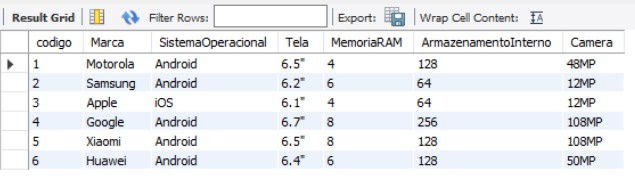
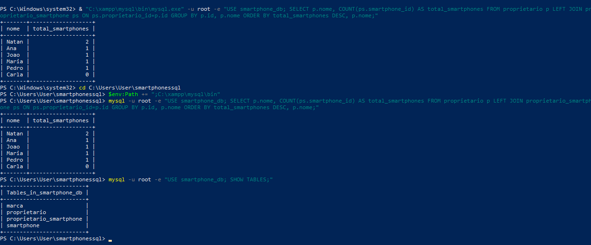

# SmartphoneDB

Projeto de banco de dados relacional para gestao de marcas, smartphones e proprietarios, com foco em modelagem correta, tipagem adequada e consultas SQL orientadas a cenarios reais.

[]()
[]()
[]()


## Objetivo

Este projeto foi estruturado para deixar de ser um exercicio basico e demonstrar pratica profissional em SQL, com os seguintes pilares:

- padronizacao de schema;
- integridade referencial;
- modelagem N:N consistente;
- consultas com valor de negocio;
- validacao tecnica de execucao.

## Escopo Funcional

O banco representa quatro entidades principais:

1. marca
2. proprietario
3. smartphone
4. proprietario_smartphone (tabela associativa N:N)

## Principais Decisoes Tecnicas

1. Nomenclatura padronizada em snake_case

- colunas como id, marca_id, proprietario_id e smartphone_id

2. Tipagem orientada ao dominio

- tela_polegadas: DECIMAL(3,1)
- camera_mp: SMALLINT UNSIGNED
- idade: TINYINT UNSIGNED
- memoria_ram_gb e armazenamento_gb: SMALLINT UNSIGNED
- sistema_operacional: ENUM('Android', 'iOS')

3. Integridade e consistencia

- UNIQUE em marca.nome
- ON DELETE RESTRICT em smartphone -> marca
- ON DELETE CASCADE em proprietario_smartphone

4. Performance basica

- indices em chaves estrangeiras para JOIN e filtro

## Consultas SQL Implementadas

O script contempla consultas comentadas com uso pratico:

1. Listagem de smartphones com suas marcas (INNER JOIN)
2. Listagem de proprietarios com seus dispositivos (JOIN multiplo)
3. Quantidade de smartphones por proprietario (LEFT JOIN + GROUP BY + COUNT)
4. Media de RAM por marca (AVG + GROUP BY)
5. Identificacao de clientes sem dispositivos (LEFT JOIN + IS NULL)
6. Filtros tecnicos por hardware (WHERE)
7. Analise com subquery (acima da media de armazenamento)

## Estrutura do Projeto

- [SmartphoneDB.sql](SmartphoneDB.sql): criacao de schema, insercoes e consultas
- [README.md](README.md): documentacao tecnica
- [evidencias_execucao_01_consulta_agrupada.jpg](evidencias_execucao_01_consulta_agrupada.jpg): resultado de consulta agregada no PowerShell
- [evidencias_execucao_02_listagem_tabelas.jpg](evidencias_execucao_02_listagem_tabelas.jpg): listagem de tabelas no banco

## Como Executar (Windows + XAMPP)

Pre requisito:

- XAMPP com MySQL/MariaDB em execucao

Passo 1. Abrir PowerShell na pasta do projeto

```powershell
cd C:\Users\User\smartphonessql
```

Passo 2. Executar o script completo

```powershell
mysql -u root -e "source C:/Users/User/smartphonessql/SmartphoneDB.sql"
```

Passo 3. Confirmar criacao das tabelas

```powershell
mysql -u root -e "USE smartphone_db; SHOW TABLES;"
```

Passo 4. Rodar uma consulta de validacao

```powershell
mysql -u root -e "USE smartphone_db; SELECT p.nome, COUNT(ps.smartphone_id) AS total_smartphones FROM proprietario p LEFT JOIN proprietario_smartphone ps ON ps.proprietario_id = p.id GROUP BY p.id, p.nome ORDER BY total_smartphones DESC, p.nome;"
```

Observacao:
Caso o comando mysql nao seja reconhecido, use temporariamente:

```powershell
$env:Path += ";C:\xampp\mysql\bin"
```

## Validacao Tecnica Realizada

Validacoes executadas com sucesso:

1. Criacao das 4 tabelas esperadas
2. Carga inicial de dados consistente
3. Execucao das consultas de negocio
4. Regra UNIQUE em marca.nome
5. Regra RESTRICT em exclusao de marca
6. Regra CASCADE na tabela associativa

## Evidencias de Execucao




## Autor

Natan da Luz
