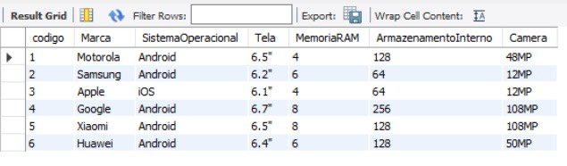
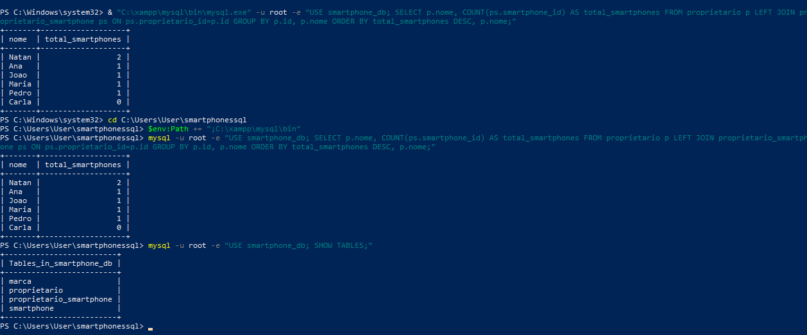

# Smartphones DB

[]()
[]()
[]()

## 📖 Sobre o projeto

O **Smartphones DB** é um projeto de banco de dados relacional desenvolvido em SQL para modelar informações sobre fabricantes, smartphones e seus proprietários.

O objetivo é demonstrar conceitos de modelagem relacional, normalização, integridade referencial, criação de tabelas, relacionamento entre entidades e elaboração de consultas aplicadas a cenários reais.

O modelo utiliza quatro entidades. A tabela associativa `proprietario_smartphone` representa a relação muitos-para-muitos entre proprietários e dispositivos, evitando a duplicação de dados e mantendo as responsabilidades de cada tabela separadas.

### Modelo de dados

| Entidade | Responsabilidade |
| --- | --- |
| `marca` | Armazena os fabricantes |
| `smartphone` | Armazena os dispositivos |
| `proprietario` | Armazena os proprietários |
| `proprietario_smartphone` | Associa proprietários e smartphones |

```text
marca
  │
  └── smartphone
          │
          └── proprietario_smartphone
                         └── proprietario
```

### Integridade Referencial

O script utiliza:

- Chaves primárias para identificar os registros;
- chaves estrangeiras para preservar os relacionamentos;
- constraints `UNIQUE` para impedir duplicidades;
- `ON DELETE RESTRICT` para bloquear exclusões que violariam dependências;
- `ON DELETE CASCADE` para remoção controlada dos vínculos na tabela associativa;
- tipos de dados adequados ao domínio.

## ✨ Funcionalidades

- Criação do modelo relacional;
- cadastro de fabricantes;
- cadastro de smartphones;
- cadastro de proprietários;
- relacionamento muitos-para-muitos;
- utilização de tabela associativa;
- definição de chaves primárias e estrangeiras;
- aplicação de constraints `UNIQUE`;
- inserção de dados iniciais para testes;
- consultas SQL com `JOIN`;
- consultas com funções de agregação;
- consultas com subqueries;
- validação das regras de integridade e do comportamento das constraints.

### Consulta de validação

O script inclui consultas aplicadas ao modelo. O exemplo abaixo contabiliza os smartphones associados a cada proprietário:

```sql
SELECT p.nome, COUNT(ps.smartphone_id) AS total_smartphones
FROM proprietario p
LEFT JOIN proprietario_smartphone ps ON ps.proprietario_id = p.id
GROUP BY p.id, p.nome
ORDER BY total_smartphones DESC;
```

## 🖼️ Screenshots

### Diagrama do modelo relacional


### Consulta agrupada por proprietário



### Listagem das tabelas



## 🚀 Tecnologias

- **SQL:** definição e manipulação dos dados com DDL e DML;
- **MySQL:** sistema gerenciador de banco de dados relacional;
- **MariaDB:** alternativa compatível para execução do script.

## ⚙️ Como executar

### Pré-requisitos

- Git;
- MySQL ou MariaDB em execução;
- cliente de linha de comando do banco ou phpMyAdmin.

### Clonar o repositório

```bash
git clone https://github.com/seu-usuario/SmartphoneDB.git
cd SmartphoneDB
```

### Importar com MySQL CLI

Execute o script a partir da raiz do repositório:

```bash
mysql -u root -e "source SmartphoneDB.sql"
```

Se o usuário exigir senha, utilize:

```bash
mysql -u root -p -e "source SmartphoneDB.sql"
```

### Importar com phpMyAdmin

1. Inicie o MySQL ou MariaDB;
2. abra o phpMyAdmin;
3. acesse a opção **Importar**;
4. selecione o arquivo `SmartphoneDB.sql`;
5. confirme a execução.

### Verificação

Após a importação:

1. Confirme a criação das quatro tabelas;
2. verifique os dados iniciais;
3. execute as consultas com `JOIN`;
4. valide as agregações, incluindo `COUNT` e `AVG`;
5. teste as restrições `RESTRICT` e `CASCADE`.

## 📂 Estrutura do projeto

O repositório reúne o script SQL, a documentação e as evidências de execução:

```text
SmartphoneDB/
├── SmartphoneDB.sql
├── README.md
├── evidencias_execucao_01_consulta_agrupada.jpg
└── evidencias_execucao_02_listagem_tabelas.jpg
```

- `SmartphoneDB.sql`: criação das tabelas, constraints, dados de teste e consultas;
- `README.md`: documentação técnica;
- `evidencias_execucao_01_consulta_agrupada.jpg`: resultado da consulta agrupada;
- `evidencias_execucao_02_listagem_tabelas.jpg`: evidência das tabelas criadas.

## 🌐 Deploy

O Smartphones DB é um projeto de banco de dados e não possui deploy web. O script pode ser executado em qualquer servidor compatível com MySQL ou MariaDB.

A instalação consiste em importar `SmartphoneDB.sql` por meio do MySQL CLI, phpMyAdmin ou outra ferramenta compatível. Para uso remoto, basta executar o script em uma instância de banco com as permissões necessárias para criar tabelas, constraints e registros.

## 👤 Autor

**Natan Da Luz**

- LinkedIn: [linkedin.com/in/natandaluz](https://www.linkedin.com/in/natandaluz/)
- Portfólio: [portfolionatan.vercel.app](https://portfolionatan.vercel.app/)
- E-mail: [natandaluz01@gmail.com](mailto:natandaluz01@gmail.com)

## 📄 Licença

Este projeto está sem uma licença definida no momento.
